# Генератор видео из источников 

Этот проект представляет собой автоматизированный конвейер для создания и загрузки видео. Он использует подключение ваших источников и ИИ для генерации сценариев, поиска релевантных изображений, синтеза речи, сборки финального видео и автоматической загрузки на YouTube и телеграм.

## Стек технологий

- **Бэкенд:** Python, FastAPI, SQLite (для хранения очереди задач)
- **Фронтенд:** Vue 3, Vite, JavaScript, CSS
- **ИИ и Модели:** Groq (LLM), Google Gemini (LLM)
- **Облачные сервисы:** Yandex Cloud SpeechKit (API v3) для синтеза речи
- **Работа с медиа:** FFmpeg (для склейки аудио, видео и наложения эффектов)
- **Автоматизация:** Playwright (управление браузером Chromium для загрузки на YouTube)

## Особенности
- **Генерация контента с помощью ИИ:** Использование современных LLM для создания коротких, вовлекающих сценариев.
- **Сборка медиа:** Автоматический поиск, скачивание фоновых медиа и сборка видео через `ffmpeg`.
- **Генерация голоса (Voiceover):** Интеграция с Yandex Cloud SpeechKit для высококачественной озвучки, а также бесплатными решениями.
- **Автоматическая загрузка на YouTube:** Использование Playwright для автоматического входа в YouTube Studio и загрузки сгенерированных видео.
- **Веб-интерфейс:** Удобное управление очередью генерации и мониторинг загрузок с помощью фронтенда.

## Текущий статус проекта
На данный момент модуль автоматического создания задач («автоматический добавлятор») еще не реализован. Пока что задачи на создание видео нужно **добавлять в ручном режиме** через веб-интерфейс. Однако после постановки задачи весь последующий процесс (генерация, сборка и выгрузка) может быть полностью автоматизирован запуском глобального планировщика.

## Галерея и Демо

### Интерфейс
<a href="assets/1.png">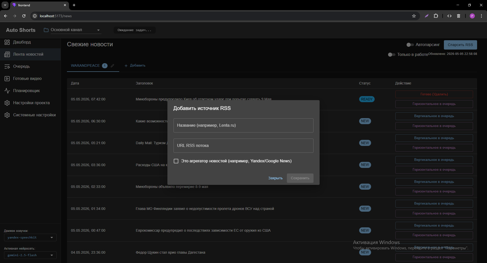</a>
<a href="assets/2.png">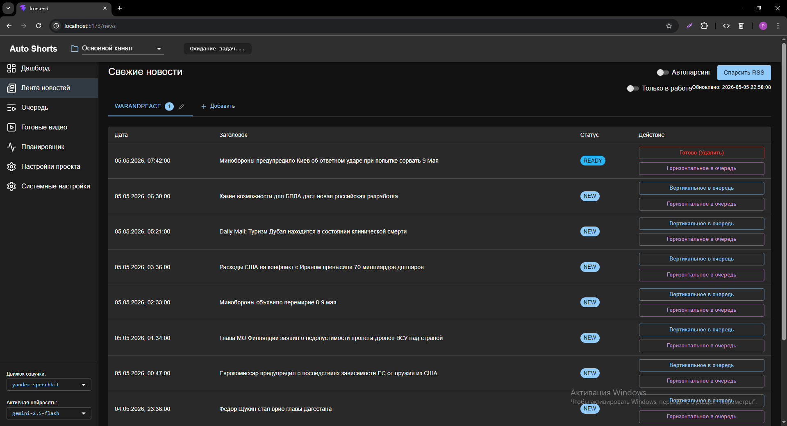</a>
<a href="assets/3.png">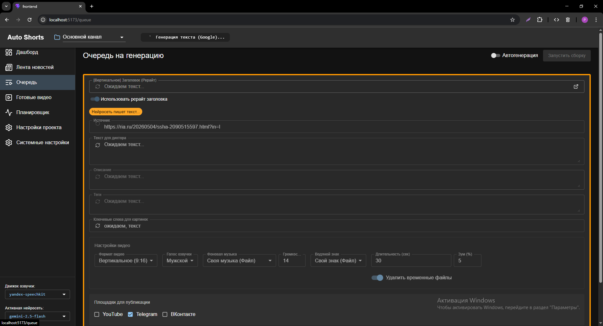</a>
<a href="assets/4.png">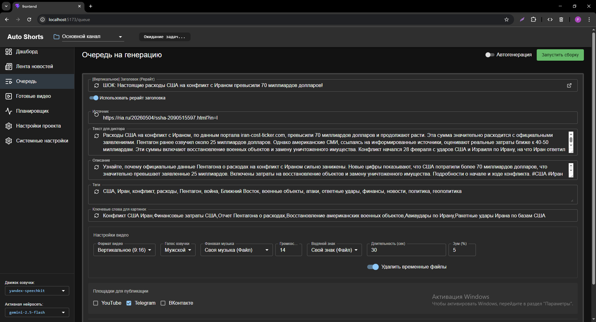</a>
<a href="assets/5.png">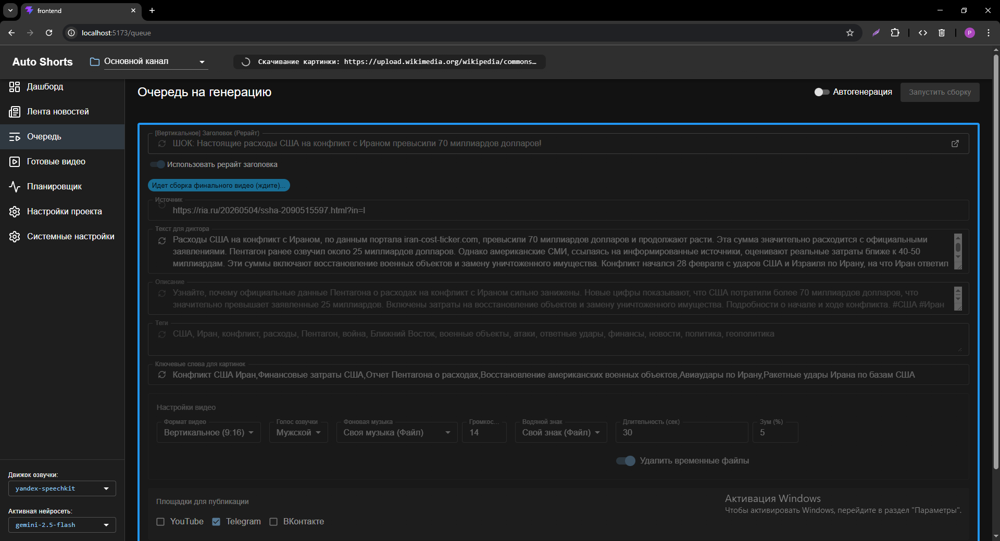</a>
<a href="assets/6.png">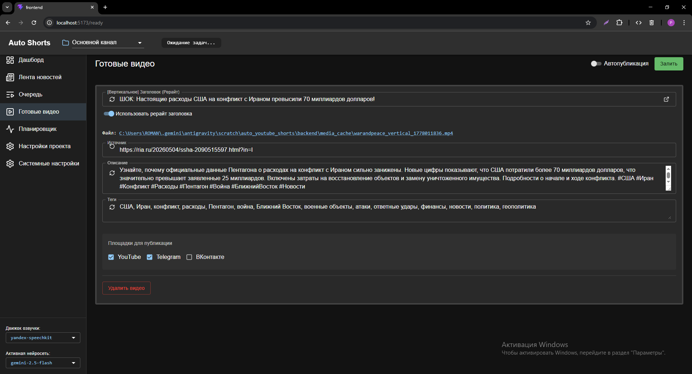</a>
<a href="assets/7.png">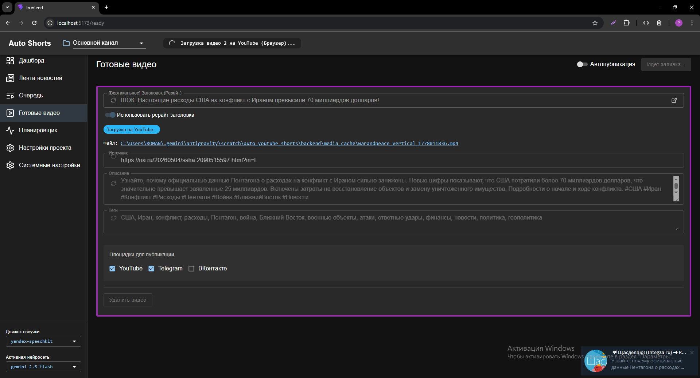</a>
<a href="assets/8.png">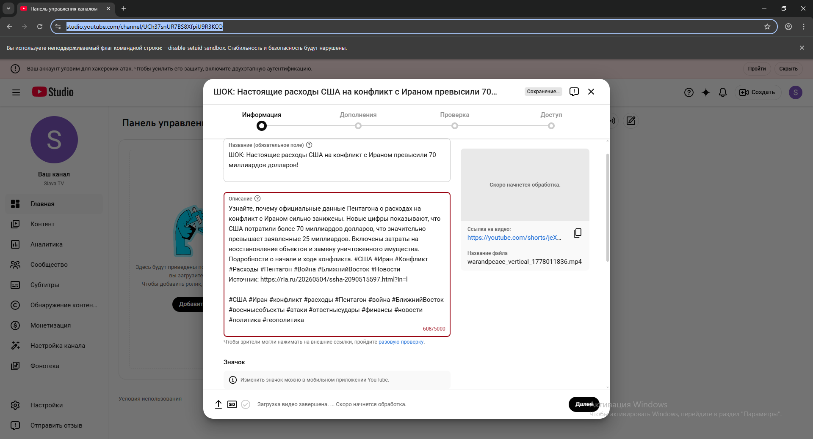</a>
<a href="assets/9.png">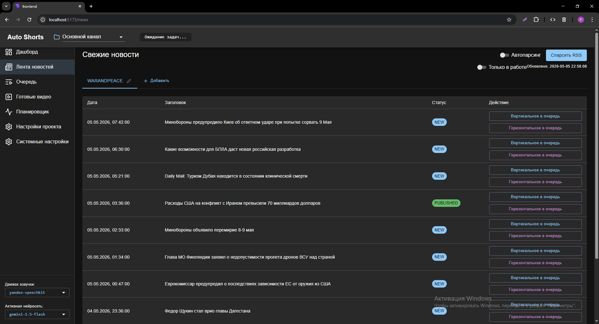</a>
<a href="assets/10.png">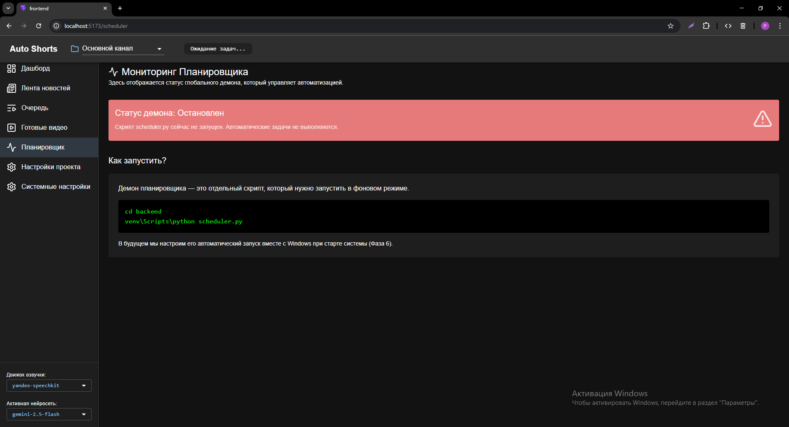</a>
<a href="assets/11.png">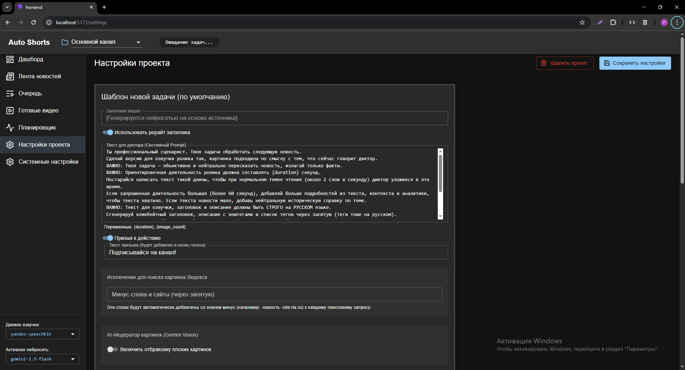</a>
<a href="assets/12.png">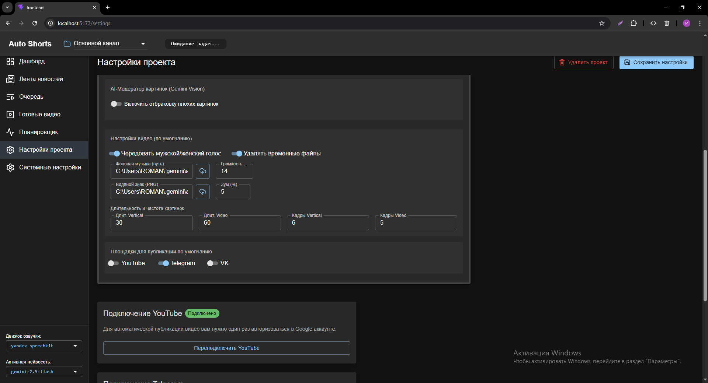</a>
<a href="assets/13.png">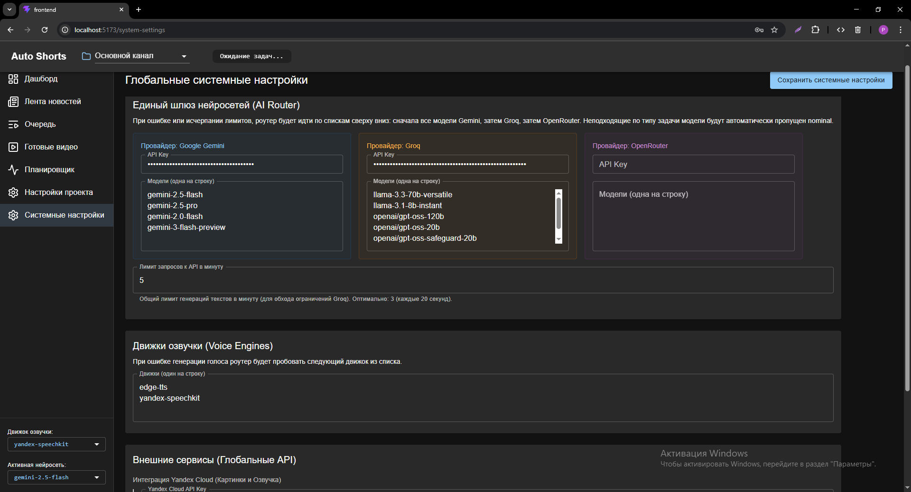</a>

### Готовый результат (Пример со скриншота)
<a href="https://rvya.ru/pr1/example.mp4">Посмотреть</a>

### Демонстрация работы системы
<a href="https://rvya.ru/pr1/demo.mp4">Посмотреть</a>

## Требования
- Установленные Python, Node.js, `ffmpeg`.
- Для работы ИИ и синтеза речи **необходимы API ключи** (Groq/Gemini, Yandex Cloud), которые должны быть прописаны в настройках.
- Отдельно необходимо установить браузер Chromium для Playwright (используется для загрузки видео).

## Как запустить проект

Для полноценной работы системы необходимо запустить три компонента в отдельных окнах терминала:

### 1. Бэкенд
Сначала установите зависимости (если вы этого еще не сделали):
```bash
cd ...\auto_youtube_shorts\backend
python -m venv venv
venv\Scripts\pip install -r requirements.txt
```
Затем запустите сервер:
```bash
venv\Scripts\python.exe -m uvicorn main:app --reload
```

### 2. Фронтенд
Сначала установите зависимости:
```bash
cd ...\auto_youtube_shorts\frontend
npm install
```
Затем запустите сервер:
```bash
cmd /c "npm run dev -- --host"
```

### 3. Автоматический планировщик (по необходимости)
```bash
cd ...\auto_youtube_shorts\backend
venv\Scripts\python scheduler.py
```

## Планы на будущее
- Реализация установки проекта в одну строку.
- Автоматическая публикация видео в **VK**, **мессенджер МАКС** и **RuTube**.
- Перенос проекта в веб.
- Оптимизация работы AI-модератора.
- Улучшение UI.

---

# Auto YouTube Shorts Generator

This project is an automated video creation and uploading pipeline. It uses your source connections and AI to generate scripts, search for relevant images/video fragments, synthesize speech, assemble the final video, and automatically upload to YouTube and Telegram.

## Tech Stack

- **Backend:** Python, FastAPI, SQLite (for task queue management)
- **Frontend:** Vue 3, Vite, JavaScript, CSS
- **AI & Models:** Groq (LLM), Google Gemini (LLM)
- **Cloud Services:** Yandex Cloud SpeechKit (API v3) for text-to-speech
- **Media Processing:** FFmpeg (for video/audio assembly and effects)
- **Automation:** Playwright (Chromium browser automation for YouTube uploads)

## Features
- **AI-Driven Content Generation:** Uses LLMs to create short, engaging video scripts.
- **Media Sourcing & Assembly:** Automatically searches for and downloads relevant background media and assembles them using `ffmpeg`.
- **Voiceover Generation:** Integration with Yandex Cloud SpeechKit for high-quality voice-over, as well as free solutions.
- **Automated YouTube Uploads:** Utilizes Playwright to automate logging into YouTube Studio and uploading the generated shorts. *Note: YouTube authorization uses Chromium, which requires a separate installation via Playwright.*
- **Modern Web Interface:** Built with Vue 3 / Vite to manage generation queues and monitor upload status.

## Current Status
Currently, the "automatic task creator" is not yet implemented. This means you must **add tasks manually** via the web interface. However, once a task is added, the rest of the pipeline (generation, assembly, and uploading) is completely automated.

## Requirements
- Python, Node.js, and `ffmpeg` must be installed.
- **API Keys are required** (Groq/Gemini, Yandex Cloud) for AI and speech synthesis.
- A separate installation of Playwright's Chromium browser is required for the YouTube uploader module.

## How to Run

To run the system, you need to manually start up to three components in separate terminal windows:

### 1. Backend
First, install the dependencies (if you haven't already):
```bash
cd ...\auto_youtube_shorts\backend
python -m venv venv
venv\Scripts\pip install -r requirements.txt
```
Then start the server:
```bash
venv\Scripts\python.exe -m uvicorn main:app --reload
```

### 2. Frontend
First, install the dependencies:
```bash
cd ...\auto_youtube_shorts\frontend
npm install
```
Then start the server:
```bash
cmd /c "npm run dev -- --host"
```

### 3. Automated Scheduler (if needed)
```bash
cd ...\auto_youtube_shorts\backend
venv\Scripts\python scheduler.py
```

## Future Plans
- One-line installation process.
- Support for automated publishing to **VK**, **MAX Messenger**, and **RuTube**.
- Migration to a web-based platform.
- AI-moderator workflow optimization.
- UI improvements.
